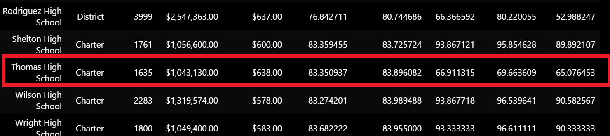
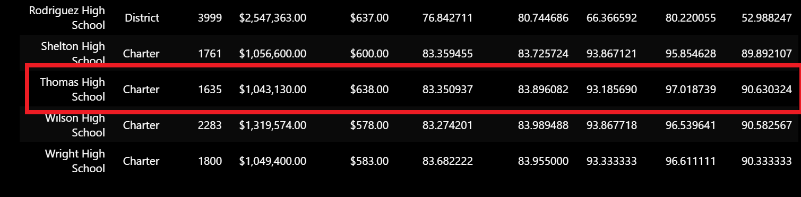

# School_District_Analysis
Anaconda3 Python 3.7 Jupyter Notebook

# Overview

**Purpose**

The purpose of our project was to help Maria with analyzing school metrics to better interpret the progress of students between the 9th and 12th grades in different schools and across districts. We wanted to find some basic information such as: 
1) Total number of students
2) Total number of schools
3) Total budget
4) Average math score
5) Average reading score
6) Percentage of students who passed math
7) Percentage of students who passed reading
8) Overall passing percentage

These values will help us better understand how students were performing in math and reading, as well as, quantify how budget may correlate with student success. Maria tasked us to develop a program that would be able to calculate these values and format charts to visualize the data. Our challenge after was to help Maria calcuate the same values for the schools excluding Thomas High School 9th graders since there is speculation of academic dishonesty. 

Our deliverables to Maria were:
1. A high-level snapshot of the district's key metrics, presented in a table format
2. An overview of the key metrics for each school, presented in a table format
3. Tables presenting each of the following metrics:
  - Top 5 and bottom 5 performing schools, based on the overall passing rate
  - The average math score received by students in each grade level at each school
  - The average reading score received by students in each grade level at each school
  - School performance based on the budget per student
  - School performance based on the school size 
  - School performance based on the type of school

**Background**

Using Jupyter Notebooks is fundamental to data analytics. It is a very popular platform for programming since it allows for easy readability and outputs both values and visuals at the same time. Pandas library is great for data analysis because it is fast, flexible, and open source which allows for wide-spread access. It is built upon python and has many functions for data manipulation, reading/writing, and similarly to excel, can produce charts and tables that quickly give descriptive statistics and more. We took advantage of importing csv files as dataframes to be easily processed whether that was handling missing data, merging data sets, or calculating statistical values.

# Results

**Analysis**
- How is the district summary affected?

**District Summary Before**

**Distric Summary After**

The performance values decreased slightly as seen from the before and after images above

- How is the school summary affected?

**School Summary Before** 

**School Summary After**

There is a significant increase in math reading and overall percentage performance after excluding the 9th grade scores for Thomas High School.

- How does replacing the ninth graders’ math and reading scores affect Thomas High School’s performance relative to the other schools?
Thomas High School's performance still remained to be within the top 5 schools. 

**Top 5 Before THS 9th grade scores removed**

**Top 5 After THS 9th grade scores removed**

- How does replacing the ninth-grade scores affect the following:

Math and reading scores by grade

Scores by school spending

Scores by school size

Scores by school type

# Summary
